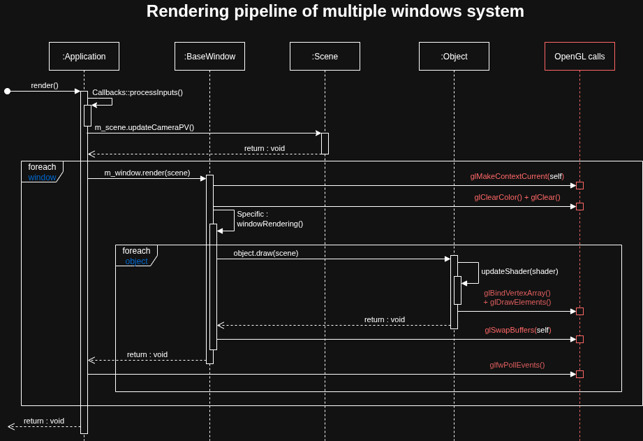

# Projet OpenGL IGAI
3D Engine project for Master IAFA (Artificial Intelligence, Fundamentals and Applications), speciality Graphic Computations at "Université de Toulouse, France" writted in C++.

## Rendering pipeline structure

### Application
Application class handle global loop of application. It's role is to process inputs and callbacks, call each window rendering process, and check for application end.

### Window
Window class (and sub-classes) handle scene rendering. Depending on the sub-class, it use scene informations (objects, lights) to produce a visible result on the screen. The standard approach, *BaseWindow*, is to call the draw() function of each object in the scene.

### Scene
Scene class stores static informations about the scene (objects, lights, camera) and dynamic informations (active camera, Projection-View matrix).

### Object
Object class (and sub-classes) is used to store informations about objects, such as transform, reference shader and material. During the rendering loop, it's update shader's uniforms (about material, transform and camera), and draw it's verticises.



## JSON Scene files system
Scenes files writted in *.json* are readed at the beggining of the program. The scene file to load need to be given as an argument.
Scene elements can be defined as follow.

### General structure
A scene is a list of elements that's compose it. A given element in the scene can be defined with this structure :

```json
"name_of_the_element" : {
    "type": "type name",

    "attribute1": "value",
    "attribute2": 42
}
```

### Availables types
All available types that can be defined are listed below.

- **camera** : a camera to visualize the 3D environment through the screen.
- **point light** : a light diffusing all around from a specific position
- **sphere** : a 3D visible sphere
- **mesh** : a 3D mesh loaded from a *.obj* file
- **bezier** : a bezier curve defined by it's control points

### Availables attributes
All availables attributes that can be defined are listed below.
- Values types defined as *group* refer to encapsulating name for sub-attributes.
- Mandatory of sub-attributes is applicable only if parent group is defined.

|Attribute name                        |Description                                                     |Value type|Accepting types|Mandatory       |
|--------------------------------------|----------------------------------------------------------------|----------|---------------|----------------|
|type                                  |Type of the object                                              |string    |ALL            |Yes             |
|transform                             |Object transformation's group                                   |group     |ALL            |No (recommanded)|
|transform > position                  |Position of the object in the scene                             |vec3      |ALL            |Yes             |
|transform > scale                     |Scale of the object                                             |vec3      |ALL            |Yes             |
|transform > rotation                  |Rotation of the object                                          |vec3      |ALL            |Yes             |
|material                              |Object material, including shader and parameters                |group     |ALL            |No (recommanded)|
|material > shader                     |Shader name in the shader manager                               |string    |ALL            |Yes             |
|material > shader material            |Shader parameters group                                         |group     |ALL            |Yes             |
|material > shader material > ambient  |Ambient value of object                                         |vec3      |ALL            |Yes             |
|material > shader material > diffuse  |Diffuse value of object                                         |vec3      |ALL            |Yes             |
|material > shader material > specular |Specular value of object                                        |vec3      |ALL            |Yes             |
|material > shader material > shininess|Shininess value of object                                       |float     |ALL            |Yes             |
|file                                  |Path to the OBJ file containing the mesh                        |string    |mesh           |Yes             |
|size                                  |Size of the object (ex: radius for sphere, length for cube, etc)|float     |sphere         |Yes 

## Screenshots


